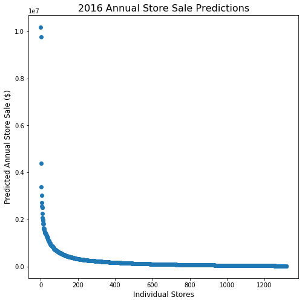

# Forecasting Iowa State Liquor Sales

---

> "Here's to alchohol, the cause of, and solution to, all life's problems." - Homer Jay Simpson (and Iowans, probably)

## Iowans bought over *\$284 million dollars* in liquor in 2015
### ...Can we predict how much will they buy in 2016?

Government policymakers often have the unenviable job of determining how to apportion state income to an endless number of competing programs. Sometimes, they have the even more unenviable job of determining how to fund those programs *without knowing how much money they will have to apportion*. For this commonly occuring case, policymakers are wise to leverage the skills, intuitions and dashingly good looks of their data scientists.


## Overview

Iowa is one of 19 states to control the sale and distribution of liquor at the state government level. 


Source: https://en.wikipedia.org/wiki/Alcoholic_beverage_control_state

All spirits within Iowa are sold to privately owned retailers by the Iowa Alcoholic Beverages Division, while leveraging a flat general sales tax of 6.0% 

This also means, however, that every liquor transaction at every store in the state of Iowa is meticulously recorded. With over **2 million transactions** every year, a data scientist might construct some pretty well-informed predictions.

---

## Fun Facts

- Average Transaction in 2015:  \$130
- Median Transaction in 2015:   \$70
- Maximum Transaction in 2015:  \$106,000
- ~10% of 2015 sales generated from just 5 stores


```python
# Top 5 sellers in 2015
sales_2015[['Sale (Dollars)']].head(5)
```


<div>
<style>
    .dataframe thead tr:only-child th {
        text-align: right;
    }

    .dataframe thead th {
        text-align: left;
    }

    .dataframe tbody tr th {
        vertical-align: top;
    }
</style>
<table border="1" class="dataframe">
  <thead>
    <tr style="text-align: right;">
      <th></th>
      <th></th>
      <th>Sale (Dollars)</th>
    </tr>
    <tr>
      <th>Store Number</th>
      <th>City</th>
      <th></th>
    </tr>
  </thead>
  <tbody>
    <tr>
      <th>2633</th>
      <th>DES MOINES</th>
      <td>9839393.08</td>
    </tr>
    <tr>
      <th>4829</th>
      <th>DES MOINES</th>
      <td>8742779.31</td>
    </tr>
    <tr>
      <th>2512</th>
      <th>IOWA CITY</th>
      <td>4155665.47</td>
    </tr>
    <tr>
      <th>3385</th>
      <th>CEDAR RAPIDS</th>
      <td>3947176.01</td>
    </tr>
    <tr>
      <th>3420</th>
      <th>WINDSOR HEIGHTS</th>
      <td>3422351.55</td>
    </tr>
  </tbody>
</table>
</div>


---

## The Nerd Stuff

### The Data:

- Over 2.7 million rows of data, each representing a single transaction, with data such as:
    - Store Number
    - Item Sold
    - Total Sale (\$)
    - ...
- Span: Jan 1st, 2015 to March 31st, 2016

### The Cleaning:

- Lots of it. But went from:


```python
iowa_df.isnull().sum()
```


    Invoice/Item Number          0
    Date                         0
    Store Number                 0
    Store Name                   0
    Address                      0
    City                         0
    Zip Code                     0
    Store Location               0
    County Number            10913
    County                    2150
    Category                   779
    Category Name             6109
    Vendor Number                0
    Vendor Name                  0
    Item Number                  0
    Item Description             0
    Pack                         0
    Bottle Volume (ml)           0
    State Bottle Cost            0
    State Bottle Retail          0
    Bottles Sold                 0
    Sale (Dollars)               0
    Volume Sold (Liters)         0
    Volume Sold (Gallons)        0
    dtype: int64


- To...


```python
iowa_merged.isnull().sum()
```


    Invoice/Item Number          0
    Date                         0
    Store Number                 0
    Store Name                   0
    Address                      0
    City                         0
    Zip Code                     0
    Store Location               0
    County Number                0
    County                    1875
    Category                     0
    Category Name              642
    Vendor Number                0
    Vendor Name                  0
    Item Number                  0
    Item Description             0
    Pack                         0
    Bottle Volume (ml)           0
    State Bottle Cost            0
    State Bottle Retail          0
    Bottles Sold                 0
    Sale (Dollars)               0
    Volume Sold (Liters)         0
    Volume Sold (Gallons)        0
    Markup per Bottle            0
    Profit                       0
    Pop                      35165
    dtype: int64


### Python Packages Used:
- Numpy
- Pandas
- Matplotlib
- Sklearn

### Models Explored:
- LinearRegression
- Ridge
- RidgeCV
---

## Predictive Model Performance and Predictions


```python
fig, ax = plt.subplots(figsize=(8,8))

plt.title('2016 Annual Store Sale Predictions', fontsize=16)
ax.set_xlabel('Individual Stores', fontsize=12)
ax.set_ylabel('Predicted Annual Store Sale ($)', fontsize=12)

plt.scatter(range(1320),y_2016_predicts_rev)
```


    <matplotlib.collections.PathCollection at 0x1a135093c8>





   * There are very clearly a few 'high' selling stores, that sell above and beyond more liquor than the average store. These might be wholesale oriented store locations, and not necessarily geared towards the 'average consumer'. Being able to classify these store types from the beginning may increase the accuracy of our predictive model.
   
---

## Conclusion
### Prediction: *\$289,740,820* in total 2016 Iowa State liquor sales, a 1.9% increase over 2015


- I haven't had the time to check my prediction (since we have do have 2016 sales data and all), but feel free to reach out let me know how right/wrong I was if you know!
