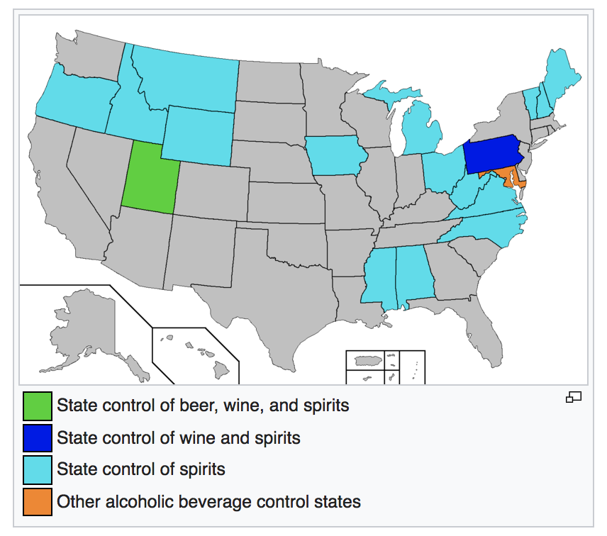
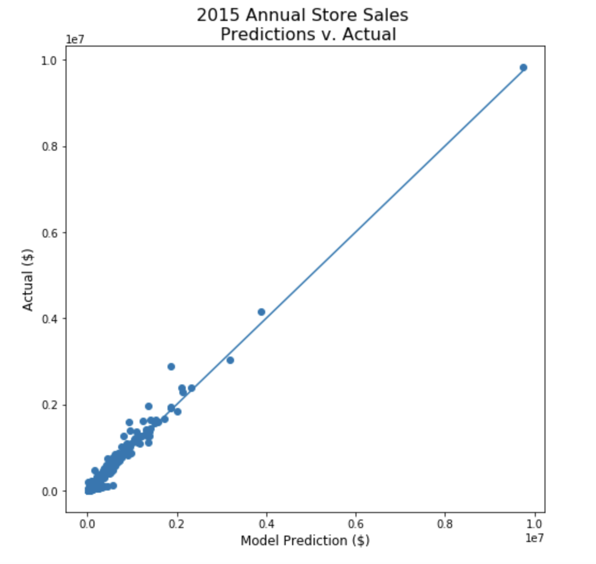
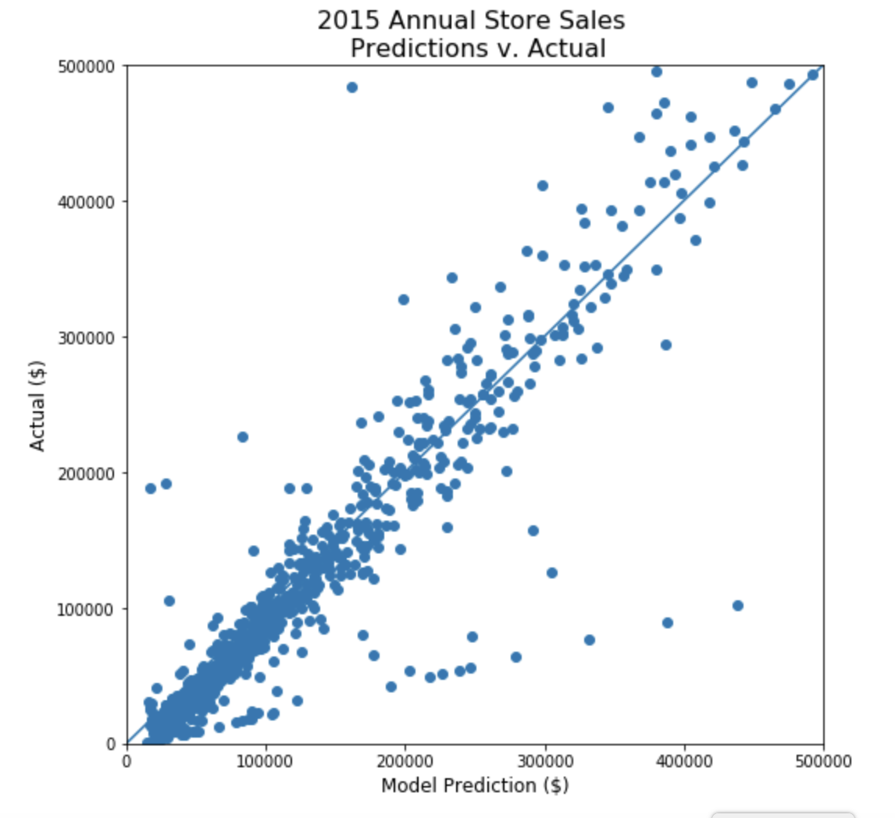

> "Here's to alchohol, the cause of, and solution to, all life's problems." - Homer Jay Simpson (and Iowans, probably)

## Iowans bought over *\$284 million dollars* worth of liquor in 2015
### ...Can we predict how much they will spend on liquor in 2016?

Government policymakers often have the unenviable job of determining how to apportion state income to fund an endless number of competing programs. Sometimes, they may even have to determine how to fund those programs in the future *without knowing how much money they will have to apportion*. For this commonly occuring case, policymakers are wise to leverage the skills, intuitions and dashingly good looks of their data scientists.

(For those interested in seeing my mess of a code, visit my GitHub page here: [https://github.com/Tucker-Allen/Iowa_State_Liquor_Sales](https://github.com/Tucker-Allen/Iowa_State_Liquor_Sales))

---

## Overview

Iowa is one of 19 states to control the sale and distribution of liquor at the state government level. 

*Source: https://en.wikipedia.org/wiki/Alcoholic_beverage_control_state*

All spirits within Iowa are sold by the Iowa Alcoholic Beverages Division to privately owned retailers, while leveraging a flat general sales tax of 6.0% 

This also means that every liquor transaction at every store in the state of Iowa is meticulously recorded. With over **2 million transactions** recorded every year, a data scientist might construct some pretty well-informed predictions.

---

## Fun Facts

- Average Transaction in 2015:  \$130
- Median Transaction in 2015:   \$70
- Maximum Transaction in 2015:  \$106,000
- ~10% of 2015 sales generated from just 5 stores

### Top 5 Selling Stores in 2015

<table border="1" class="dataframe">
  <thead>
    <tr style="text-align: left;">
      <th></th>
      <th></th>
      <th>Store Number</th>
      <th>City</th>
      <th>Sale (Dollars)</th>
      <th></th>
    </tr>
  </thead>
  <tbody>
    <tr>
      <th>2633</th>
      <th>DES MOINES</th>
      <td>9839393.08</td>
    </tr>
    <tr>
      <th>4829</th>
      <th>DES MOINES</th>
      <td>8742779.31</td>
    </tr>
    <tr>
      <th>2512</th>
      <th>IOWA CITY</th>
      <td>4155665.47</td>
    </tr>
    <tr>
      <th>3385</th>
      <th>CEDAR RAPIDS</th>
      <td>3947176.01</td>
    </tr>
    <tr>
      <th>3420</th>
      <th>WINDSOR HEIGHTS</th>
      <td>3422351.55</td>
    </tr>
  </tbody>
</table>

---

## The Nerd Stuff

### The Data:

- Over 2.7 million rows of data, each representing a single transaction, with data such as:
    - Store Number
    - Item Sold
    - Total Sale (\$)
    - ...
- Span: Jan 1st, 2015 to March 31st, 2016

### The Cleaning:

- Lots of it. Can see at 

### Features Engineered:
- Profit (Sale - State Cost)
- Population of city where transaction was recorded

### Python Packages Used:
- Numpy
- Pandas
- Matplotlib
- Sklearn

### Models Explored:
- LinearRegression
- Ridge
- RidgeCV

---

## Predictive Model Performance and Predictions

### ...zoomed in a bit to the lower left...

### Individual Store Annual Sale predictions based on Q1 data

   * There are very clearly a few 'high' selling stores, that sell above and beyond more liquor than the average store. These might be wholesale-oriented store locations, and not necessarily geared towards the 'average consumer'. Being able to classify these store types at the beginning may increase the accuracy of our predictive model.
   
---

## Conclusion
### Prediction:
### *\$289,740,820* in total 2016 Iowa State liquor sales
### (1.9% increase over 2015)

- I haven't had the time to check my prediction (since we have do have 2016 sales data and all), but feel free to reach out let me know how right/wrong I was if you know!
